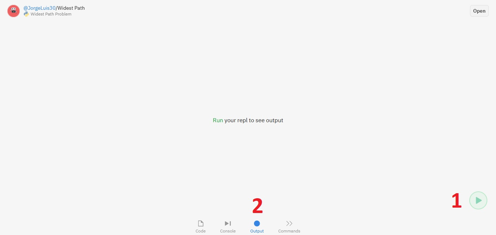
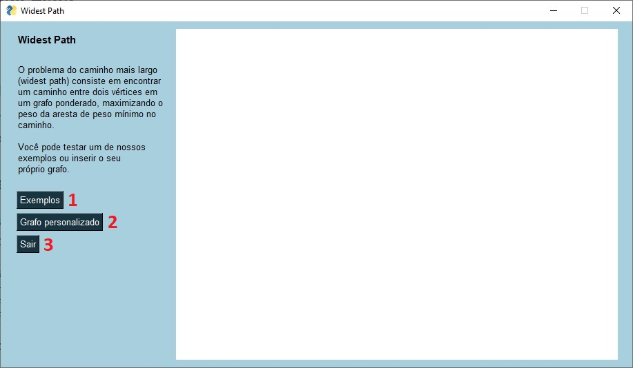
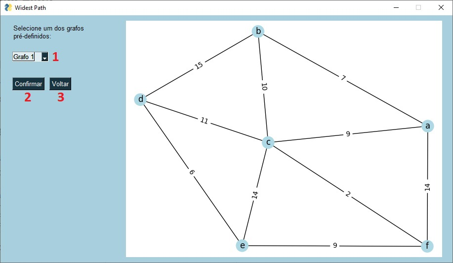
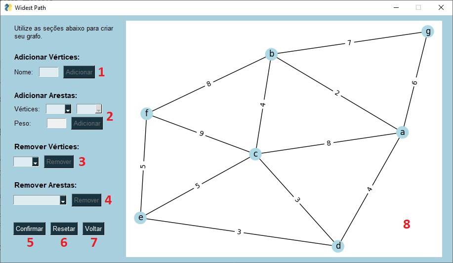
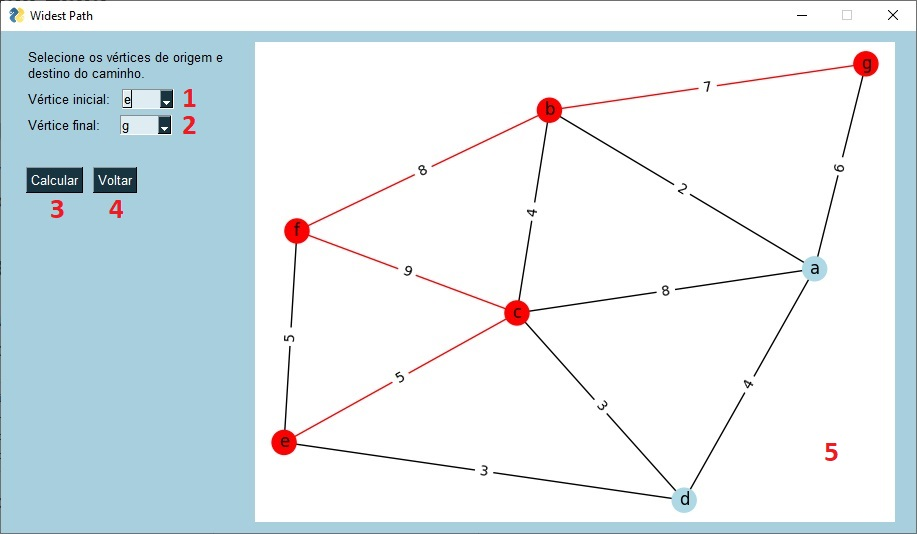

<h1 align="center">Widest Path Visualizer</h1>

## Tabela de conteúdos
<!--ts-->
1. [Autoria](#autoria)
2. [Descrição do Projeto](#descrição-do-projeto)
3. [Opções de execução](#opções-de-execução)
   1. [Executar código pelo terminal](#executar-código-pelo-terminal)
   2. [Executável (.exe)](#executável-exe)
   3. [Interface Web](#interface-web)
4. [Como Usar](#como-usar)
   1. [Tela inicial](#tela-inicial)
   2. [Tela de seleção de exemplos](#tela-de-seleção-de-exemplos)
   3. [Tela de criação e edição do grafo](#tela-de-criação-e-edição-do-grafo)
   4. [Tela de cálculo e visualização do Widest Path](#tela-de-cálculo-e-visualização-do-widest-path)
5. [Implementação](#implementação)

<!--te-->

## Autoria

Jorge Luis da Silva Batista Filho  
Bacharelando em Ciência da Computação  
Universidade Federal da Bahia  
Matrícula: 219216367

## Descrição do Projeto

O "Problema do Caminho Mais Largo" (Widest Path Problem) consiste em encontrar o caminho entre dois vértices em um grafo ponderado de forma a maximizar  o peso da aresta de peso mínimo nesse caminho. O objetivo deste software é prover uma ferramenta para calcular o widest path num grafo simples e permitir a sua visualização.

## Opções de execução
### Executar código pelo terminal

O código foi implementado Python Python 3.9.5. Também foram utilizados as seguintes bibliotecas: 
* networkx 2.5.1
* matplotlib 3.4.2
* PySimpleGui 4.41.2

Para executar pelo terminal, certifique-se que o Python e as bibliotecas estão intaladas, abra o terminal e navegue para o diretório em que está o código e execute o comando:
> python widest_path.pyw

Você pode tentar executar o código em versões diferentes do Python e das bibliotecas, mas não há garantia de que vá funcionar. Caso haja problemas, instale as versões listadas ou tente um dos métodos abaixo.

### Executável (.exe)
No diretório do projeto também está incluído um arquivo .exe do software para Windows 10 pronto para utilização. Não é necessário instalação, basta executar.

### Interface Web

Para utilizar a versão online do software, acesse o link https://replit.com/@JorgeLuis30/Widest-Path?embed=1 no seu browser.

   

Após abrir a página clique no botão de play (1) e aguarde enquanto o servidor configura o ambiente virtual. Após encerrada a configuração, clique em "Output" (2) para visualizar o programa.

## Como Usar

### Tela inicial

   

Na tela inicial do software podemos escolher se iremos trabalhar com um dos grafos de exemplo ou se vamos criar nosso próprio grafo.

1. Ir para a tela de seleção dos grafos de exemplo.
2. Ir para a tela de criação e edição do grafo.
3. Fechar o software.

### Tela de seleção de exemplos

   

Nesta tela podemos escolher um dos três grafos de exemplo pré-definidos.
1. Lista para selecionar um dos grafos de exemplo.
2. Confirmar a escolha do grafo e ir para tela de cálculo e visualização do Widest Path.
3. Voltar para o menu principal.

### Tela de criação e edição do grafo

   

Neste tela podemos criar e editar um grafo simples para ser utilizado no cálculo do Widest Path.

1. Para adicionar um vértice, inserimos um nome (máx. 5 caracteres) para o vértice e clicamos no botão "Adicionar".
2. A adição de aresta só será habilitada quando o grafo possuir pelo menos dois vértices. Para adicionar uma arestas, selecionamos os dois vértices da aresta em cada lista, inserimos o peso (máx. 5 dígitos) e clicamos no botão "Adicionar". Caso já exista uma aresta entre esses dois vértices, ela será substituída (o peso será atualizado).
3. Para remover um vértice, escolhemos a aresta a ser removida e clicamos no botão "Remover". Ao remover um vértice, todas as arestas que incidem nele serão removidas.
4. Para remover uma aresta, selecionamos a aresta desejada na lista e clicamos em "Remover". As arestas são denotadas na forma "(a,b)", onde "a" e "b" são os vértices de extremidade da aresta.
5. Após o termino da criação do grafo, podemos clicar em "Confirmar" para ir para a tela de cálculo e visualização do Widest Path.
6. Para deletar todas as informações inseridas no grafo de uma vez, podemos clicar em "Resetar.
7. Para voltar ao menu principal clicamos em "Voltar".
8. Área de visualização do grafo.

### Tela de cálculo e visualização do Widest Path

   

Nesta tela escolhemos as aresta de início e fim do caminho a ser calculado.

1. Lista de seleção do vértice inicial.
2. Lista de seleção do vértice final.
3. Botão para calcular o Widest Path.
4. Voltar para tela anterior.
5. Área de vizualição do grafo com o Widest Path destacado em vermelho.

## Implementação

A implementação do software foi feita na linguagem Python, utilizando a biblioteca PySimpleGUI para criar a interface gráfica. A biblioteca matplotlib foi utiliza para plotar as imagens dos grafo.

Para a manipulação dos grafos foi utilizada a biblioteca networkx, onde para o cálculo do Widest Path é utilizado o algoritmo Maximum Spanning Edges sobre o grafo, produzindo um segundo grafo, que é uma árvore geradora com os pesos maximizados do primeiro grafo, e encima desse segundo grafo é utilizado o algoritmo Shortest Path, chegando assim no resultado. Mais detalhes estão comentados no código.

